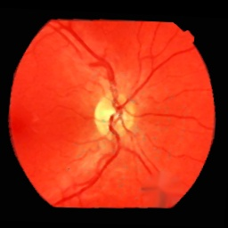
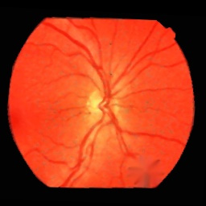
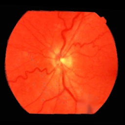
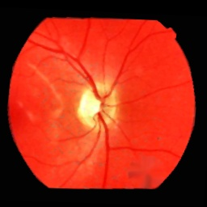
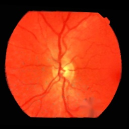

# Fundus Image Processing
## Overview
For this project, 40 images of the fundus of the eye were provided. These images suffered from defects such as noise, warping and colour channel imbalances. The challenge was to improve the performance of this pre-trained classifier by only applying image processing techniques. 

This classifier was trained on non-defected images and used to detect the presence of glaucoma. Performance was measured by the accuracy of the classifier on processed images and these images visual quality.  

## Method
The image processing pipeline consists of the following:

1. Inpainting Holes
    * Inpainting applied to the hole in the bottom right 

2. Gamma Correction
    * Images were underexposed, so applied 0.8 gamma
3. Pepper Noise Replacement
    * Custom method to remove pepper noise
    * Converts to Y_Cr_Cb colour space
    * Inpaints pixels with less than 25 Cb that lie within the eye  
4. CLAHE - Contrast-Limited Adaptive Histogram Equalisation
    * Adaptive Histogram Equalisation (AHE) applies histogram equalisation to pixels within a neighbourhood
    * If there are many similar pixels in a neighbourhood, the contrast is overamplified
    * Contrast-Limited AHE prevents overamplification, reducing additional noise
5. Median Filter
    * The Median filter removes salt and pepper noise whilst only minimally removing edges
6. Perspective Fixing
    * Unprocessed images are warped and rotated
    * Due to the elliptical shape, the image is warped using points on its major and minor axis

To find a more detailed description of the experimentation conducted and design choices, please read `report/Image Processing Report.pdf`.

## Results
* The classifier performs with accuracy of 57.5% on the unprocessed images
* After applying the proposed image processing pipeline, accuracy increased to 80.0%
* Visual quality and detail is significantly improved

Here are eight cherry picked unprocessed and processed images:

| Original Image | Enhanced Image |
|----------------|----------------|
|  |  |
|  |  |
|  |  |
|  |  |
|  |  |
|  |  |
|  |  |
|  |  |

## Running the Code
To produce the processed images, run `python main.py`.
* To specify the path, add the path argument i.e `python main.py --path=PATH`
* To show each unprocessed image and its processed version, add the show argument `python main.py --show=y`
    * When viewing these images press the q key or exit button to move to the next one

To run the classifier on the images, run `python classify.py`
*   To specify the image directory, add the data argument i.e `python main.py --data=results`
* The default directory used is the unprocessed images in `test_images` 